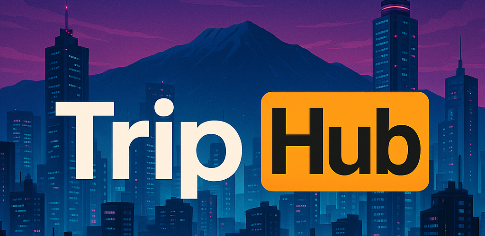

<p align="center">
  
</p>

**Trip Hub Card Explorer** is an interactive web application that helps users discover and explore trip ideas in a visually engaging way. Built with **React + Vite**, it combines modern design, smooth animations, and fast performance to deliver an intuitive browsing experience.

---

## ✅ Features

- **Trip grid** rendering from `/public/data.json`, with proper loading & error states.
- **Image loader**: subtle 3-dot overlay until the image fully loads (even when it’s not a 404).
- **Search**: keep all cards visible; matches are auto-prioritized to the front, non-matches are **dimmed** instead of hidden.
- **Sort by Rating** toggle (on/off), descending.
- **Details modal** with full description and rating.  
  **Spec:** “Add a ‘More Info’ button that opens a modal …” →  
  **My build:** the **entire card is the button** (click/Enter opens the modal).
- **A11y**: keyboard navigation on cards (`role="button"`, `tabIndex=0`, Enter/Space), ESC to close modal, focus management.
- **Prod-ready** Vite build (dev, build, preview scripts).
---
## 🎨 Design Decisions & Reasoning
#### Card Interaction
- I decided to make each trip card itself a clickable element (a button). This makes the experience more intuitive and natural — users can click anywhere on the card instead of searching for a small “More Info” button. It also avoids repeating unnecessary UI elements across every card. Having a “More Info” label on each tile adds visual noise and distracts from the content. My goal was to keep the interface clean and focused, guiding the user’s attention only to what matters.

#### Image Optimization
- The img.js utility was created to optimize image loading and rendering. It limits the resolution and color depth of downloaded images to reduce bandwidth usage and improve performance. This helps the app remain smooth and lightweight even with many large Unsplash images.

#### Search Behavior
- I chose to implement search by reordering and dimming non-matching results rather than removing them. This creates a modern, fluid experience where the user still sees all trips, but relevant ones stand out. It avoids the abrupt “disappearing content” effect typical of older websites and keeps the interface feeling alive and dynamic.

#### Design Philosophy
- My overall goal was to create a clean, focused, and modern user interface — one that directs attention efficiently without overloading the user with repetitive elements or distractions. Every interaction and motion serves clarity and flow, not decoration.

---
## ⚖️ Trade-offs

#### Card as a button 
- Improves usability and visual clarity, but slightly reduces explicit affordance for users who expect a “More Info” label. I mitigated this by adding hover and focus states to indicate interactivity.

#### Search dimming instead of hiding 
- Visually appealing and smooth, but requires extra rendering of all cards, which might affect performance on very large datasets. For this project’s scope, it’s a worthy trade-off for the UX gain.

#### Image optimization 
- Limiting resolution slightly reduces image sharpness, but drastically improves performance and loading speed — an intentional balance between quality and speed.

#### Minimalist UI 
- Reduces distractions and emphasizes visuals, but offers fewer on-screen hints for first-time users. I compensated with consistent hover feedback and accessibility roles.
---

## 🧱 Tech Stack

- **React 18** + **Vite**
- **SCSS/CSS modules** for component styling

---

## 🚀 Quick Start

```bash
# 1) Install
npm install

# 2) Start dev server
npm run dev
# Vite usually runs at http://localhost:5173

# 3) Build for production
npm run build

# 4) Preview production build
npm run preview

